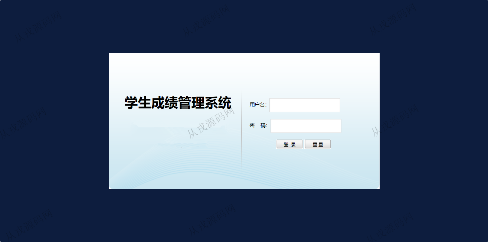
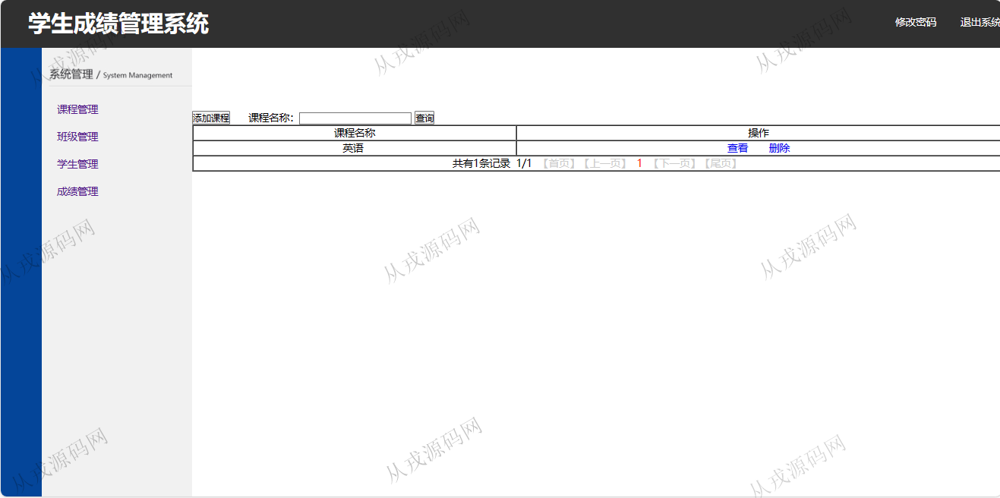
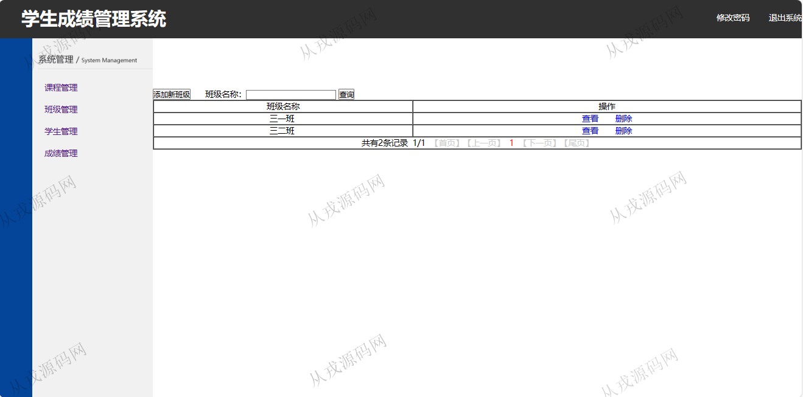
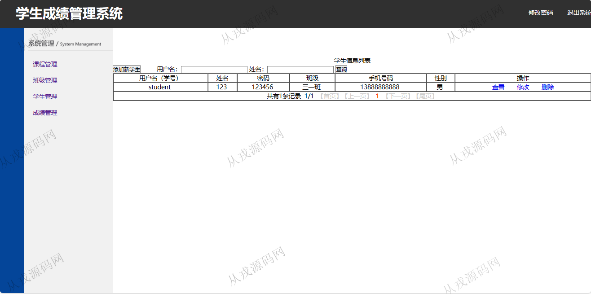
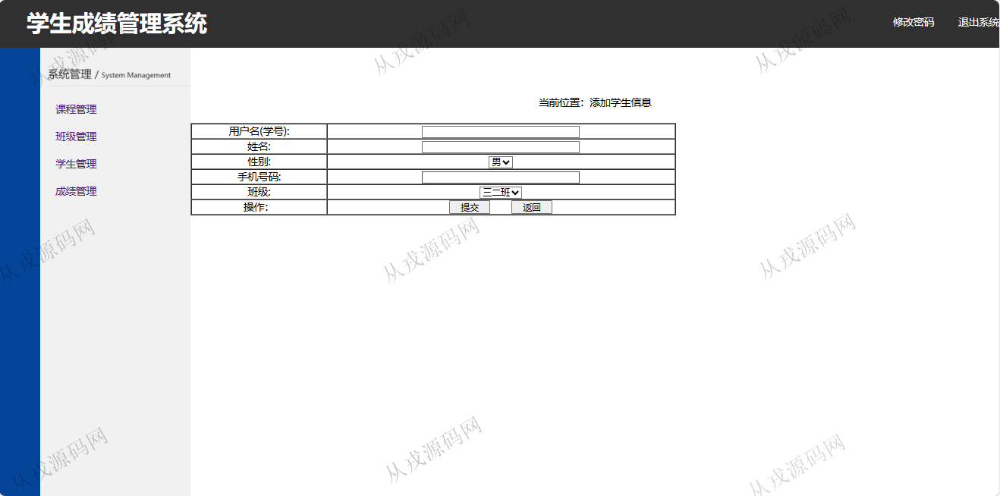
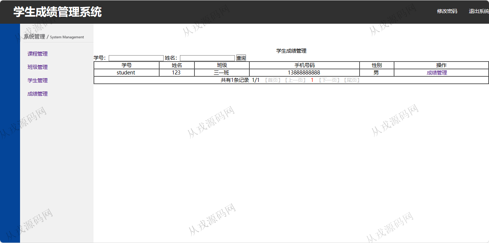
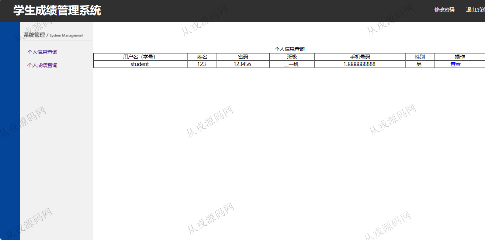
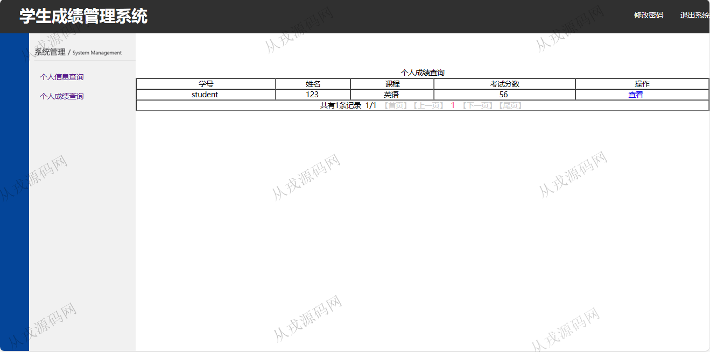
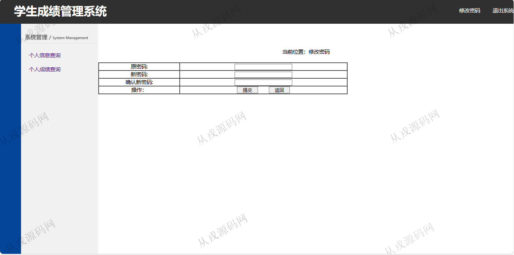

<h1 align="center">203.学生成绩管理系统</h1>

 获取sql文件 QQ: 386869957 QQ群: 377586148 

 [更多源码项目: 从戎源码网](https://armycodes.com/) 

## 简介

> 本代码来源于网络,仅供学习参考使用!
>
> 提供1.远程部署/2.修改代码/3.设计文档指导/4.框架代码讲解等服务
> 
> http://localhost:8080/cp351/login.jsp
> 
> admin  123456
>

## 项目介绍
基于java+jsp的学生成绩管理系统：前端 jsp、jquery，后端 servlet、jdbc；角色分为管理员、学生；集成课程管理、班级管理、学生管理、成绩管理等功能于一体的系统。

## 功能介绍

- 基本功能：登录，退出，密码修改
- 课程管理：课程信息的增删改查，按课程名称模糊查询
- 班级管理：班级信息的增删改查，按班级名称模糊查询
- 学生管理：学生信息的增删改查，按用户名和姓名模糊查询，给学生重置密码
- 成绩管理：根据学生信息进行成绩管理，成绩信息的增删改查

## 环境

- <b>IntelliJ IDEA 2021.3</b>

- <b>Mysql 5.7.26</b>

- <b>Tomcat 7.0.73</b>

- <b>JDK 1.8</b>

## 运行截图

